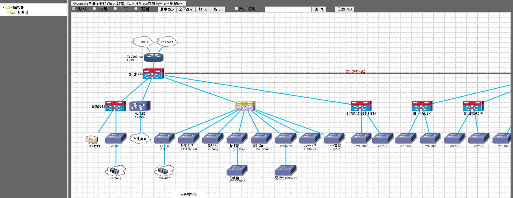

# 功能

+ 左侧栏使用easyui实现的，可以查看不同层次的路由，默认打开的是网络拓朴完整页面，也是最完善的一个页面
+ 拓朴图上面的按钮是可以将更改的拓朴图的json数据及时在console中打印出来，IE下支持另存为功能
+ 使用的json数据是通过自己写的序列化和反序列化function进行构造的
+ node节点和link节点均具有右键菜单的功能，使用了css，这部分是demo中参考，自己不会
+ 双击节点或link可以修改text内容，其中link双击可以快速删除节点

图形效果：

